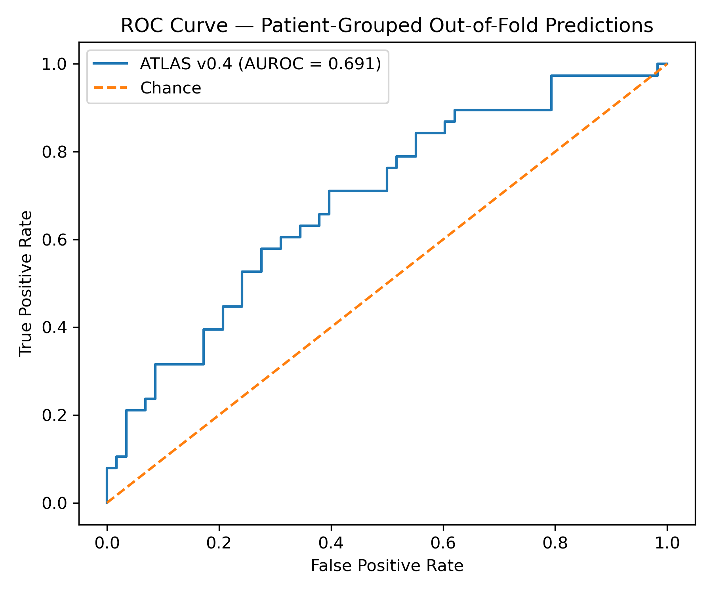
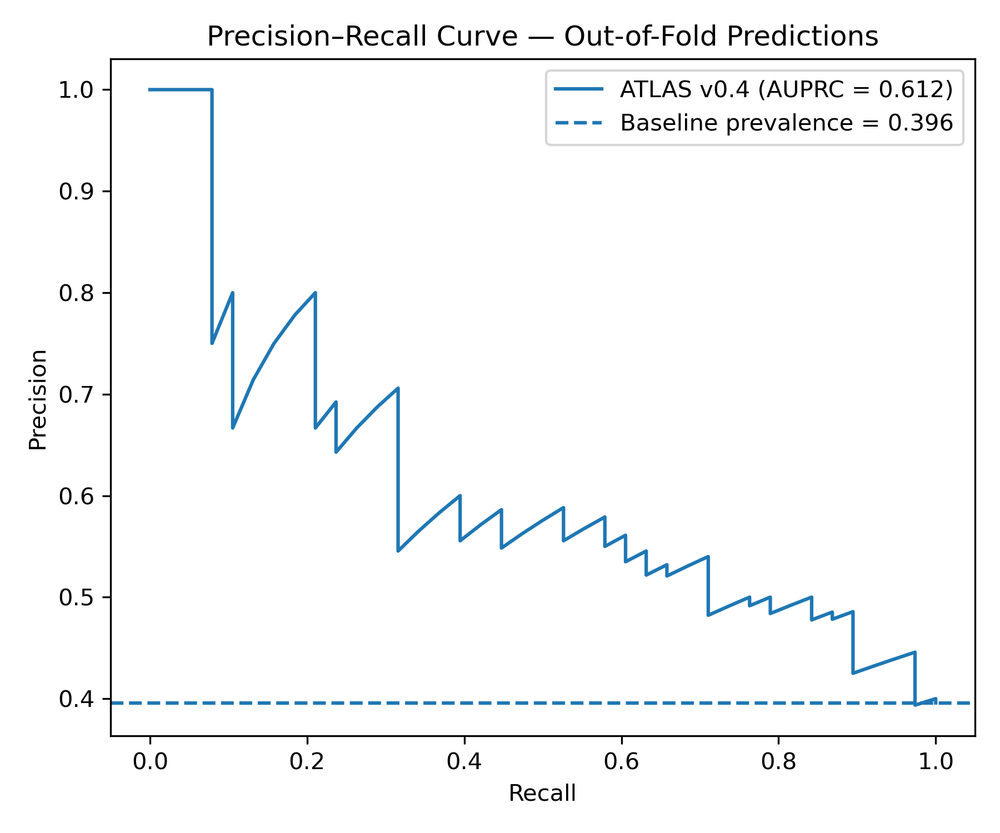

# 🧠 ATLAS — Early ICU Deterioration Prediction

ATLAS is a clinical AI proof-of-concept exploring whether routinely collected vital signs during the first 6 hours of an ICU stay can identify patients at increased risk of subsequent persistent physiological instability.

The project emphasizes:

- temporal validity before model complexity
- prevention of data leakage
- patient-level validation
- interpretability
- honest reporting of limitations

> Current version: ATLAS v0.4

---

## Clinical Question

Can early ICU vital-sign patterns predict persistent physiological instability during the following 24 hours?

ATLAS v0.4 uses a strict temporal design:

- Observation window: first 6 hours after ICU admission
- Prediction window: hours 6–30 after ICU admission
- Data source: MIMIC-IV demo
- Primary model: L2-regularized logistic regression

Only information available during the observation window is used for prediction.

---

## Outcome Definition

The current endpoint is a proxy physiological outcome, not a validated clinical deterioration endpoint.

A positive event is defined as persistent physiological instability during hours 6–30:

- at least 2 systolic blood pressure measurements < 90 mmHg, or
- at least 2 SpO₂ measurements < 90%,
- with abnormal measurements separated by at least 30 minutes.

This persistence requirement reduces the influence of isolated abnormal readings or measurement artifacts.

---

## Cohort

After requiring a complete 24-hour prediction window following the initial 6-hour observation period:

- 96 eligible ICU stays
- 72 unique patients
- 38 positive events
- 39.6% event prevalence

Because several patients had more than one eligible ICU stay, validation was grouped by patient identity.

---

## Features

The compact baseline model uses early measurements of:

- Age
- Heart rate: mean and maximum
- Respiratory rate: mean and maximum
- Systolic blood pressure: mean and minimum
- SpO₂: mean and minimum

Systolic blood pressure combines available non-invasive, arterial, and manual measurements to improve early-window coverage.

Clearly implausible physiological values are removed before feature construction.

---

## Validation Strategy

ATLAS v0.4 uses Stratified Group 5-Fold Cross-Validation with subject_id as the grouping variable.

This prevents ICU stays from the same patient from appearing in both training and validation folds.

Preprocessing and standardization are performed inside a scikit-learn pipeline.

---

## Results

### Patient-grouped 5-fold cross-validation

- Mean AUROC: 0.717 ± 0.074
- Mean AUPRC: 0.634 ± 0.172

### Pooled out-of-fold predictions

- AUROC: 0.691
- AUPRC: 0.612
- Sensitivity at 0.50 threshold: 0.526
- Specificity at 0.50 threshold: 0.724

The event-prevalence baseline for precision–recall performance is 0.396.

The pooled AUPRC of 0.612 suggests that early vital-sign patterns contain predictive signal beyond baseline prevalence in this small demo cohort.

These results represent proof-of-concept performance only, not evidence of clinical utility.

### ROC Curve

### Precision–Recall Curve

---

## Interpretation

Lower systolic blood pressure during the first 6 hours showed the strongest association with subsequent physiological instability.

Because several engineered variables are correlated — for example, mean and minimum values from the same vital sign — individual logistic-regression coefficients should not be interpreted causally or in isolation.

The purpose of ATLAS v0.4 is to demonstrate a clinically coherent prediction pipeline rather than optimize a headline metric.

---

## Data Leakage: Development Lesson

Earlier ATLAS experiments produced unrealistically high performance because the outcome was indirectly related to information also present in the predictors.

That failure became a central design lesson for v0.4.
The current pipeline addresses this by:

1. defining the clinical question before model training
2. separating observation and prediction windows in time
3. excluding future-derived variables such as completed ICU length of stay from predictors
4. grouping validation by patient
5. reporting realistic rather than optimized performance

Identifying and correcting leakage is an important part of clinical machine-learning practice.

---

## Limitations

- Small MIMIC-IV demo cohort
- Proxy physiological endpoint rather than a validated clinical deterioration endpoint
- Limited clinical variables
- No external validation
- Correlated summary features may affect individual coefficient estimates
- Performance estimates remain uncertain because of the small sample size
- Results should not be interpreted as evidence of clinical utility

---

## Next Steps

Future versions of ATLAS will explore:

- larger MIMIC-IV cohorts
- richer temporal and trend-based features
- clinically validated deterioration endpoints
- calibration and decision-threshold analysis
- additional interpretable baselines and more advanced models
- external or temporal validation

The priority will remain clinical validity and leakage prevention before model complexity.

---

## Notebook

The current analysis is available in:

[atlas_v4_early_deterioration.ipynb](atlas_v4_early_deterioration.ipynb)

The earlier v0.3 notebook is retained to document the project's development history and the data-leakage lesson.

---

## Data

ATLAS uses the MIMIC-IV demo dataset.

The clinical data are not included in this repository. Users should obtain the appropriate MIMIC-IV demo files separately.

---

## Tech Stack

- Python
- pandas
- NumPy
- scikit-learn
- matplotlib
- JupyterLab / Jupyter Notebook

---

## Author

Majed Hamad, MD  
Medical doctor transitioning into Clinical AI and clinical decision-support research.

Focus: interpretable machine learning, ICU deterioration, temporal clinical data, and clinically meaningful decision-support systems.

---

## Project Status

ATLAS v0.4 — active development

The current version establishes a temporally valid and patient-grouped baseline for future work with larger datasets, richer endpoints, and more advanced clinical AI methods.
